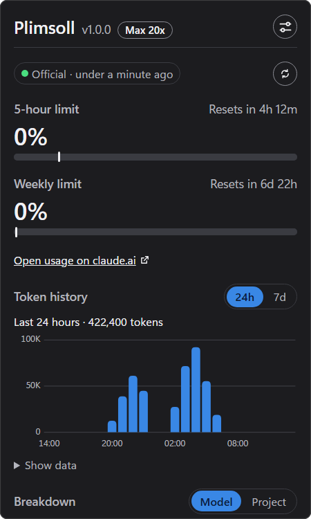

# Plimsoll

> Your Claude plan limits, in the Windows system tray.

<p align="center">
  
</p>

## Install

Run this in PowerShell:

```powershell
irm https://github.com/haikalmumtaz233/plimsoll/releases/latest/download/install.ps1 | iex
```

It installs Plimsoll for the current user, without admin rights, and starts it in the tray. Run it again to update. You can also download the installer from [Releases](https://github.com/haikalmumtaz233/plimsoll/releases).

Turn on **Accurate mode** in Settings to see the official percentages.

## Features

- Five-hour and weekly limits with reset countdowns
- Per-model weekly limits and extra usage credits
- Tray icon with the five-hour percentage and alert colors
- Notifications at 50, 80, and 95 percent, adjustable
- Token history by model and project
- English and Indonesian, light and dark themes

## Privacy

Plimsoll reads usage fields from Claude Code logs and never reads conversation content. In accurate mode it sends your Claude Code sign-in token only to `api.anthropic.com`, the endpoint behind `/usage`. When that sign-in expires, Plimsoll runs Claude Code's `/usage` in the background so Claude Code renews it. Plimsoll never refreshes or rewrites the token itself. No telemetry, and all data stays on your machine.

## Requirements

- Windows 10 1809 or later, x64 or ARM64
- Claude Code signed in with a Pro or Max plan

## Build from source

```powershell
pnpm install
pnpm tauri dev
```

Unofficial. Not affiliated with or endorsed by Anthropic. Released under the [MIT License](LICENSE).
